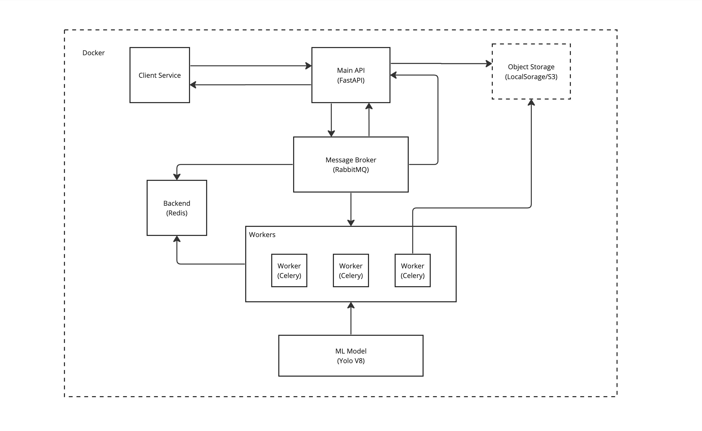

# Сервис для детектирования лиц

## Текущий статус

Бета - версия

### Чеклист:
- [ ] Перевод vue.js на работу с продакшн (пока стоит хард-код на адрес)

- [ ] Продакшн-образы (полное конфигурирование переменных для контейнеров)

- [ ] Персистентное хранилище для задач - скорее понадобится MongoDB или PostgreSQL для работы в длинную, чтобы хранить историю и юзеров

- [ ] S3 для хранения фотографий

- [ ] Прокси на контейнеры (сейчас фронт идет на локалхост)


# Архитектура предлагаемого решения


Компоненты:
1. Веб-апи (FastAPI)
2. Очередь обработки (Redis)
3. Брокер сообщений (RabbitMQ)
4. Воркеры (Celery)
2. Пользовательский интерфейс (Vue.js)



# Запуск (Docker)

0. Создание .env файла (если отсутствует)

```shell

make env

```


1. Создание образа
```shell

make docker-build

```


2. Запуск контейнеров

```shell
make docker-run

```
